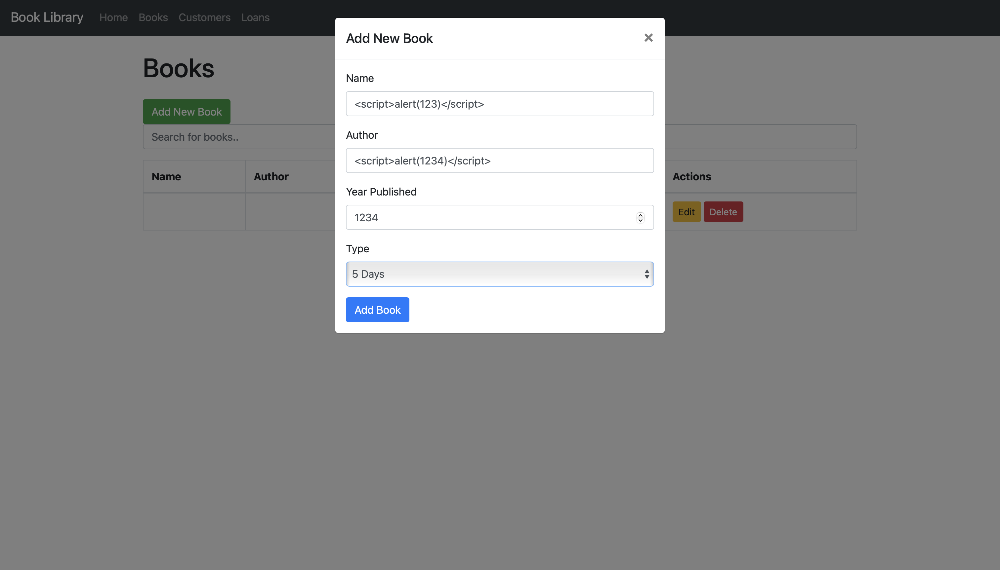
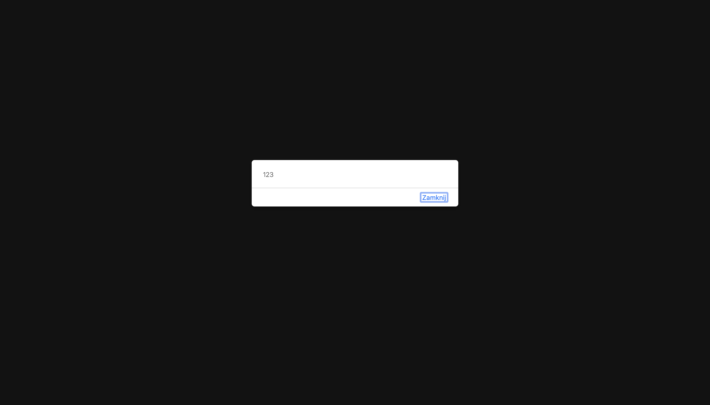
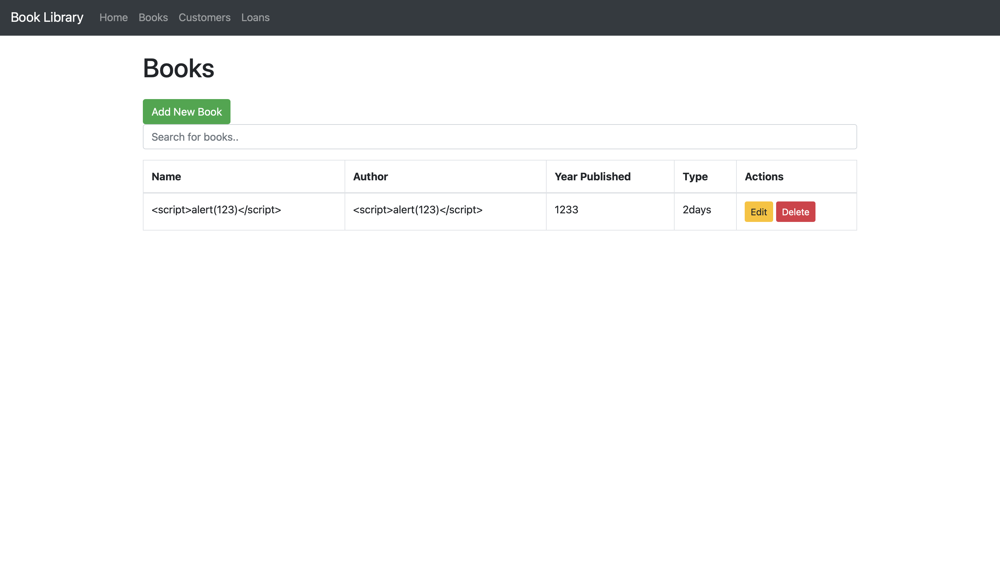
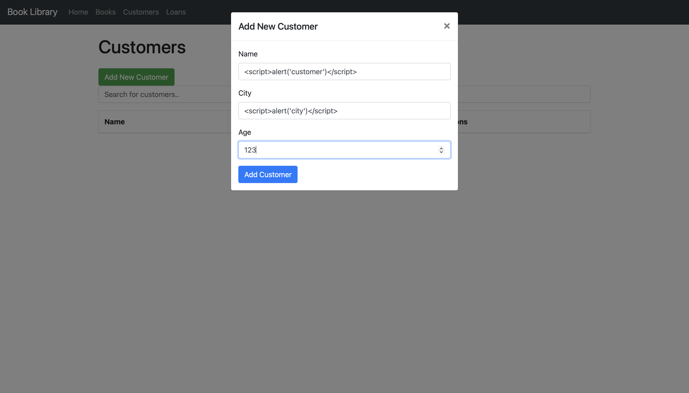
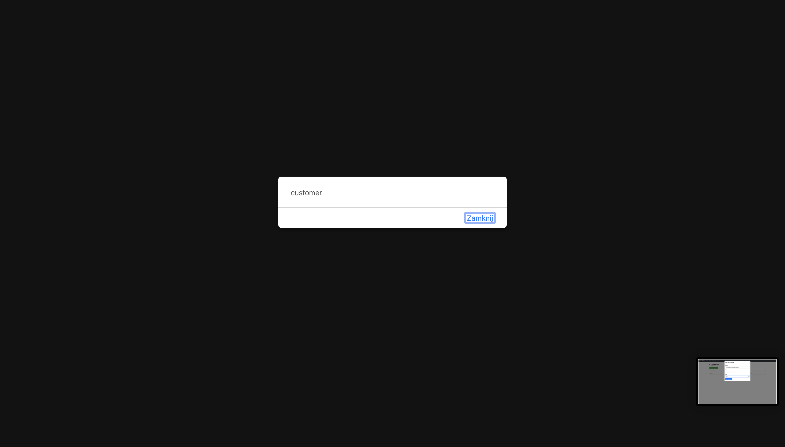
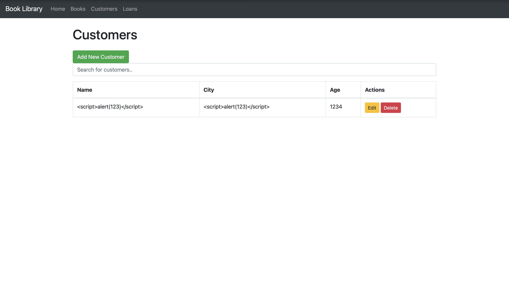
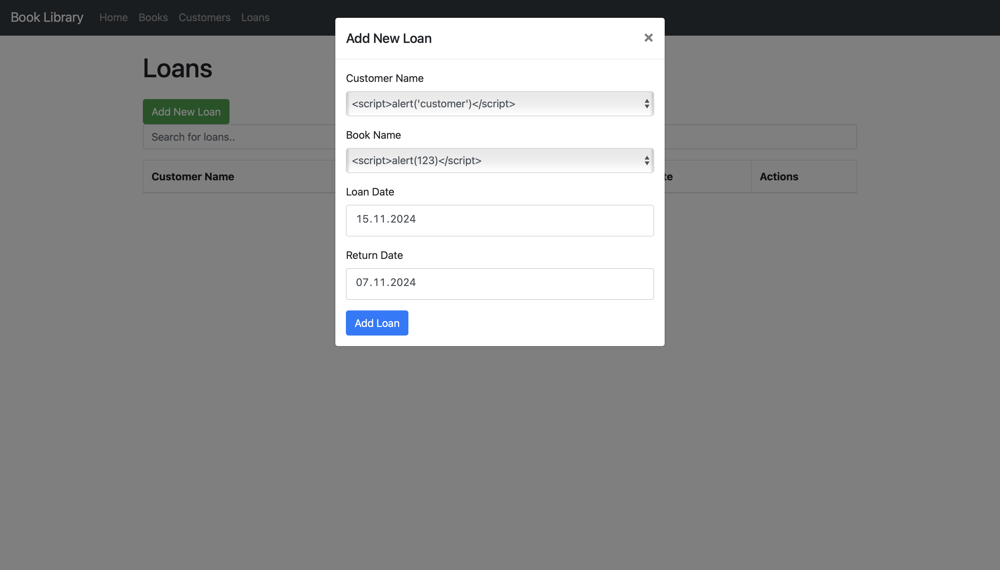
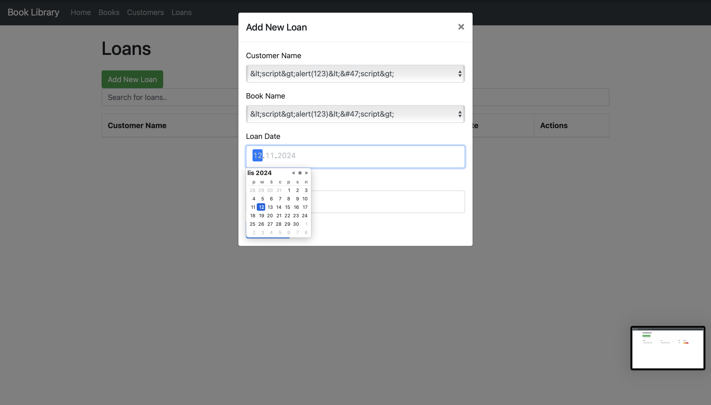

# Sprawozdanie z analizy podatności XSS w aplikacji biblioteki książek

## 1. Wprowadzenie
Aplikacja implementowana w Pythonie za pomocą frameworka Flask umożliwia zarządzanie książkami, klientami oraz wypożyczeniami. Przetestowano aplikację pod kątem podatności typu Cross-Site Scripting (XSS), w szczególności w formularzach do dodawania książek, klientów oraz wypożyczeń.

## 2. Znalezione podatności
### 2.1. Formularz dodawania książek
- Podatność: Możliwość wstrzyknięcia kodu JavaScript w polach tekstowych "Name" oraz "Author".
- Wynik: Po zapisaniu danych w bazie kod JavaScript jest wyświetlany na liście książek, co powoduje jego wykonanie.
- Dowód:
  - **Formularz dodawania książki z XSS:**
    
  - **Wykonanie kodu XSS w przeglądarce:**
    
  - **Wynik po poprawieniu:**
    

### 2.2. Formularz dodawania klientów
- Podatność: Możliwość wstrzyknięcia kodu JavaScript w polach tekstowych "Name" oraz "City".
- Wynik: Kod JavaScript jest wyświetlany i wykonywany w przeglądarce po zapisaniu.
- Dowód:
  - **Formularz dodawania klienta z XSS:**
    
  - **Wykonanie kodu XSS w przeglądarce:**
    
  - **Wynik po poprawieniu:**
    

### 2.3. Formularz wypożyczeń
- Podatność: Dane klientów i książek przenoszone z encji zawierających kod XSS są renderowane bez weryfikacji.
- Dowód:
  - **Formularz wypożyczeń z XSS:**
    
  - **Wynik po poprawieniu:**
    

## 3. Wprowadzone poprawki
### 3.1. Zastosowanie biblioteki `nh3`
- Kod został zmodyfikowany, aby oczyszczać dane wejściowe przy użyciu funkcji `nh3.clean_text()`.
- Poprawiono klasy:
  - **Books**: W pliku `project/books/models.py` zmodyfikowano konstruktor, aby weryfikować i oczyszczać pola `name` i `author`.
  - **Customers**: W pliku `project/customers/models.py` zmodyfikowano konstruktor, aby oczyszczać pola `name` i `city`.

### 3.2. Przykład poprawionego kodu
#### Books
```python
from nh3 import nh3

class Book(db.Model):
    def __init__(self, name, author, year_published, book_type, status='available'):
        self.name = nh3.clean_text(name)
        self.author = nh3.clean_text(author)
        self.year_published = year_published
        self.book_type = book_type
        self.status = status
```

#### Customers
```python
from nh3 import nh3

class Customer(db.Model):
    def __init__(self, name, city, age):
        self.name = nh3.clean_text(name)
        self.city = nh3.clean_text(city)
        self.age = age
```

#### Loans
```python
from nh3 import nh3

class Loan(db.Model):
    def __init__(self, customer_name, book_name, loan_date, return_date, original_author, original_year_published, original_book_type):
        self.customer_name = nh3.clean_text(customer_name)
        self.book_name = nh3.clean_text(book_name)
        self.loan_date = loan_date
        self.return_date = return_date
        self.original_author = nh3.clean_text(original_author)
        self.original_year_published = original_year_published
        self.original_book_type = original_book_type
```

## 4. Dodatkowe uwagi
- Zastosowane poprawki zapobiegają atakom typu XSS, jednak nie zapewniają pełnej walidacji danych.
- Zalecane usprawnienia:
  - Weryfikacja poprawności wartości (np. zakres lat dla pól `year_published`).
  - Weryfikacja długości ciągów znaków i wymaganie wypełnienia wszystkich obowiązkowych pól.
  - Typowanie danych na poziomie aplikacji (np. użycie bibliotek takich jak `pydantic`).

## 5. Wnioski
Zidentyfikowane podatności zostały zaadresowane poprzez oczyszczanie danych wejściowych na poziomie backendu. Wprowadzone zmiany zabezpieczają aplikację przed atakami typu XSS, jednak dalsze walidacje mogą poprawić integralność i jakość danych.
